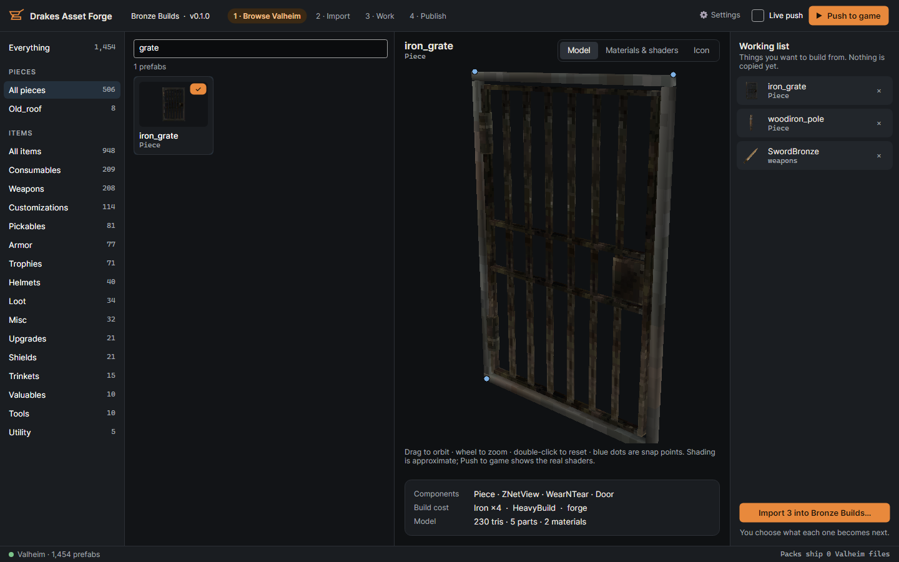
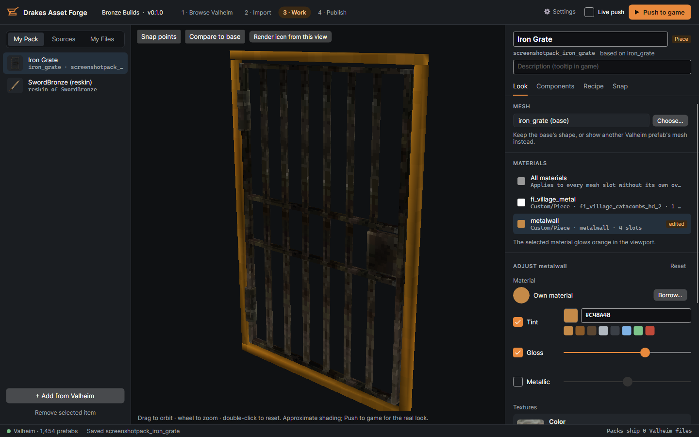
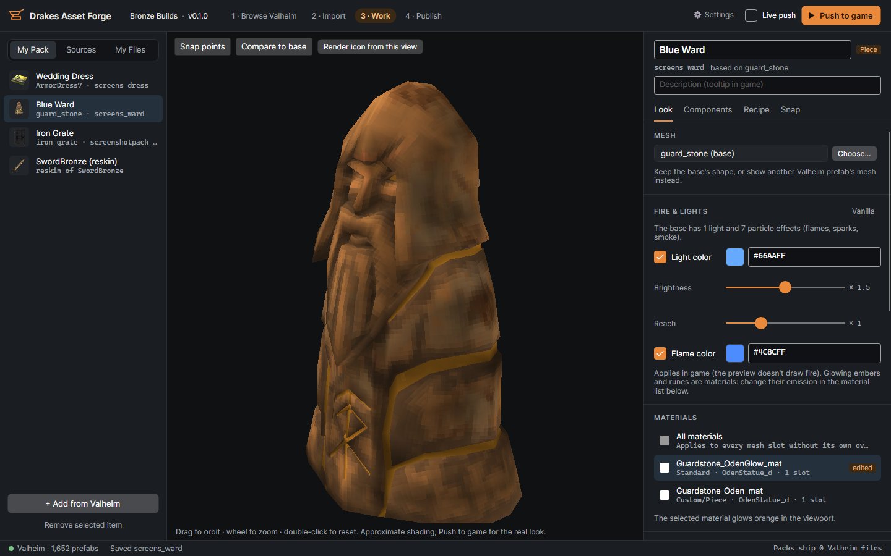
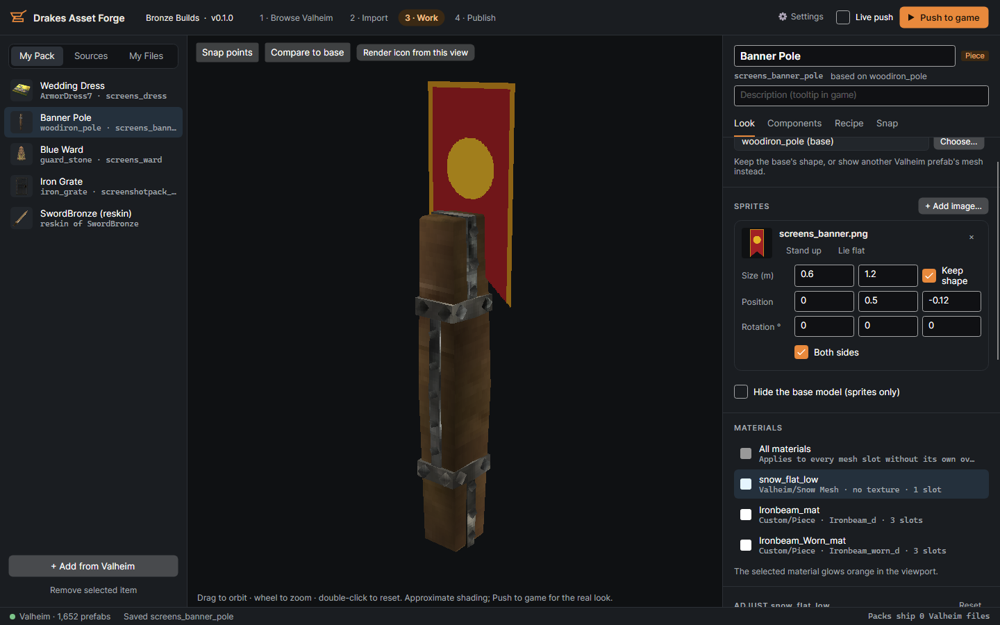
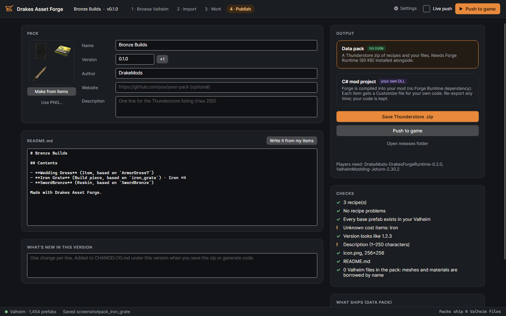

# Drakes Asset Forge (Tool)

**This package is the desktop TOOL** — the Windows app authors use to create Valheim items,
build pieces, reskins, and data packs. It is **not** a gameplay mod by itself.

Ship content made with this tool as separate Thunderstore / Hexium packages (data packs that
need [Forge Runtime](#related-packages), or your own C# mods). Players who only want your finished
content install those packs — not this Tools package.

## What this tool does

Make Valheim items, pieces and reskins **without Unity**: browse your install, restyle meshes and
materials, edit components, snap points, sprites, fire and glow — then push into a running game or
publish a tiny data pack.

| | |
|---|---|
|  |  |
|  |  |
|  |  |
|  |  |

## Install (Gale / Hexium)

1. Install this **Tools** package into a Valheim profile (BepInEx + Jotunn come with the usual
   setup; **Forge Runtime** is listed as a dependency so push/test works in that profile).
2. Open the profile folder → `BepInEx/plugins/DrakeMods-DrakesAssetForge/`.
3. Run **`DrakesAssetForge.exe`** (self-contained Windows exe — not a BepInEx plugin DLL).
4. In ⚙ Settings, point the app at Valheim and this same mod-manager profile.

You still need Valheim installed on the machine (the app reads it; it never changes game files).

## What is in this package

- `DrakesAssetForge.exe` — the Forge tool (self-contained; no separate .NET install)
- Store metadata: `manifest.json`, `icon.png` (256×256), this README, `CHANGELOG.md`
- Screenshots under `screenshots/`
- Bundled `runtime/` + `forge-src/` helpers the app uses for install/export (same as the portable zip)

## Related packages

| Package | Role | Links |
|---|---|---|
| **Drakes Asset Forge** (this) | Authoring **tool** (exe) | [GitHub releases (app)](https://github.com/drakethos/DrakesAssetForge/releases?q=app-v) · [source](https://github.com/drakethos/DrakesAssetForge) |
| **Drakes Forge Runtime** | BepInEx mod that **loads** Forge data packs for players | [GitHub releases (runtime)](https://github.com/drakethos/DrakesAssetForge/releases?q=runtime-v) · package `DrakeMods-DrakesForgeRuntime` |
| **Data packs / content mods** | What you publish from the tool for players | Made in-app (Publish → data pack or C# / plain C#) |

Forge Runtime is updated only when the loader itself changes — not on every Tools / app release.
This Tools package depends on the current published Runtime so profiles stay ready for push and test.

## Portable zip (optional)

GitHub Releases also attach `DrakesAssetForge-<version>-win-x64.zip` if you prefer to unzip the
app outside a mod profile. Same exe either way:
https://github.com/drakethos/DrakesAssetForge/releases

## Links

- Source & docs: https://github.com/drakethos/DrakesAssetForge
- App changelog: see `CHANGELOG.md` in this package
- Issues / ideas: https://github.com/drakethos/DrakesAssetForge/issues
