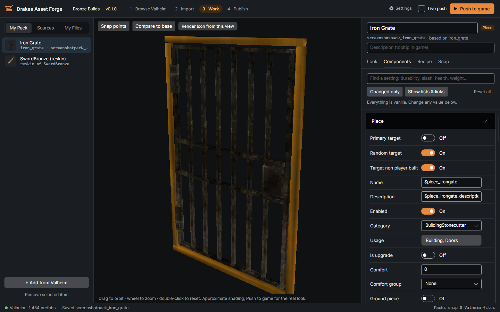
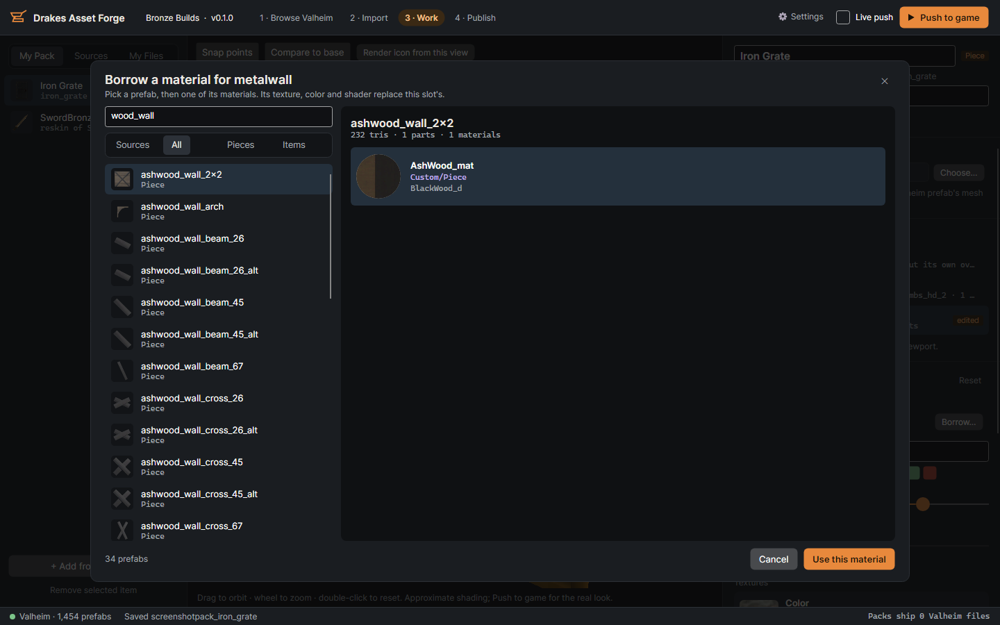
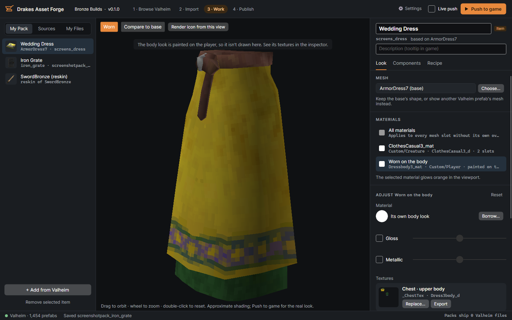
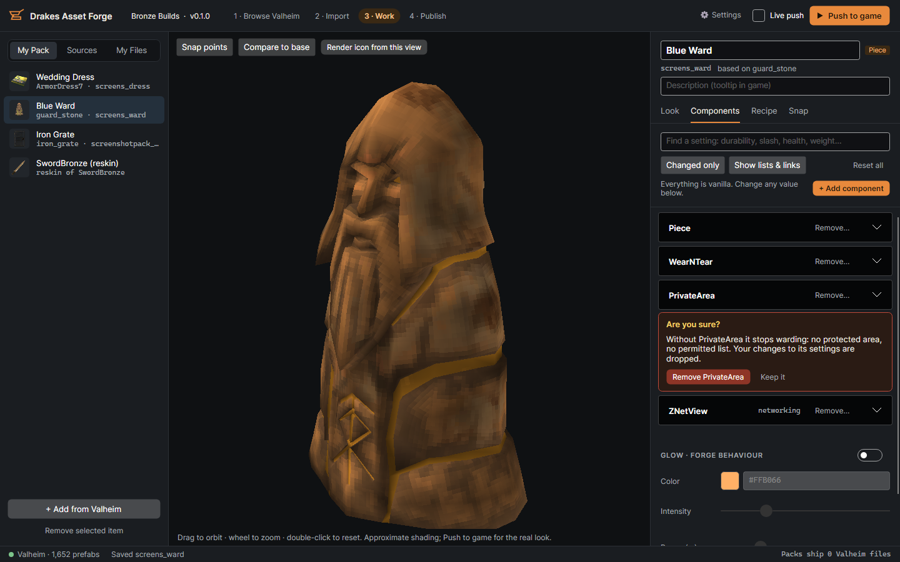
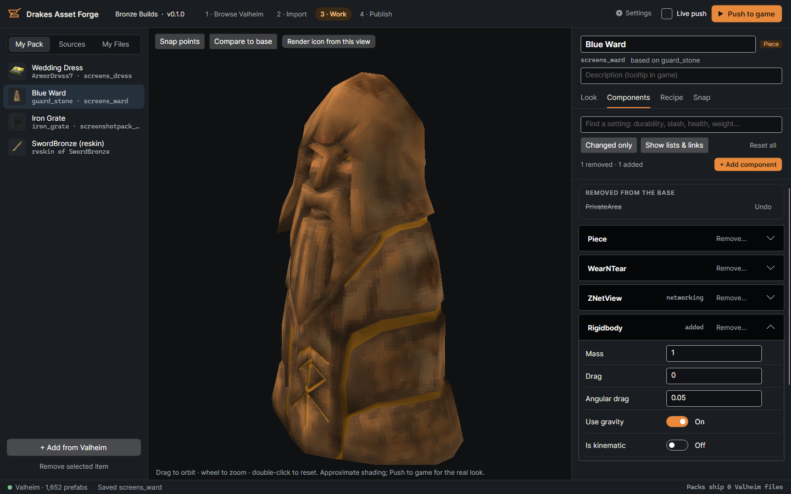
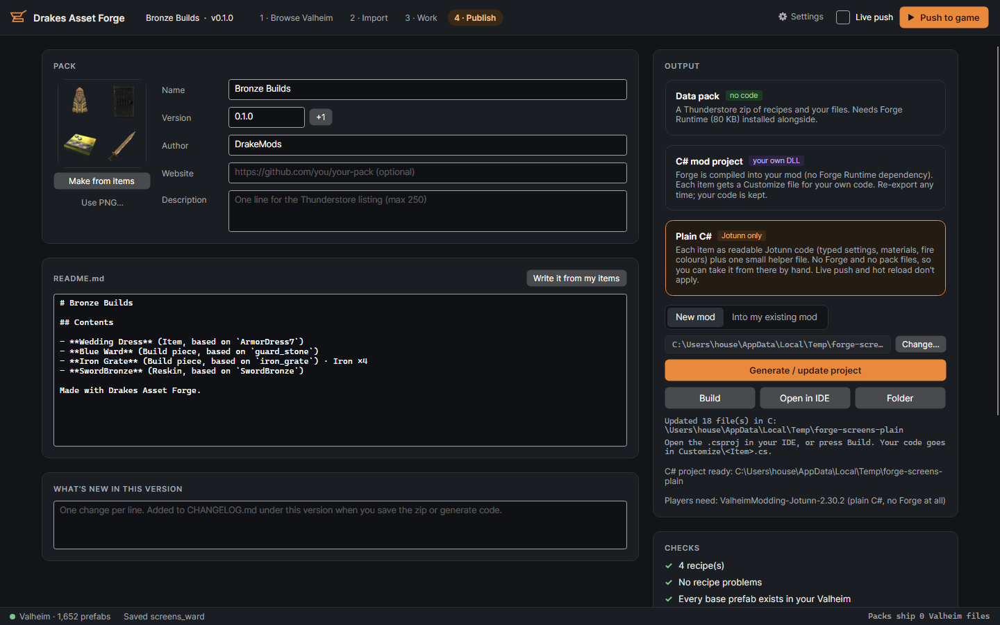
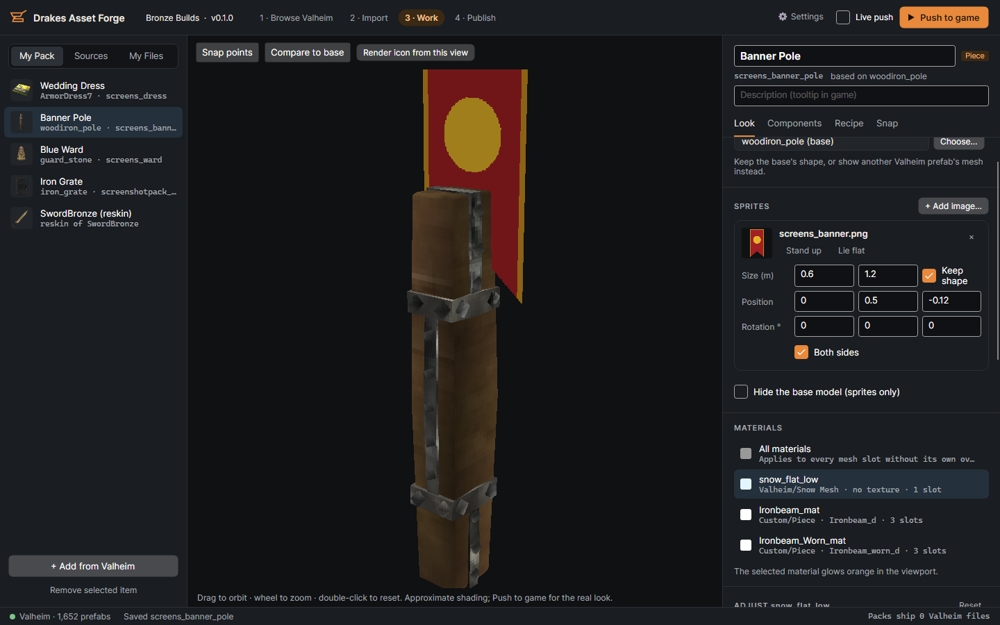
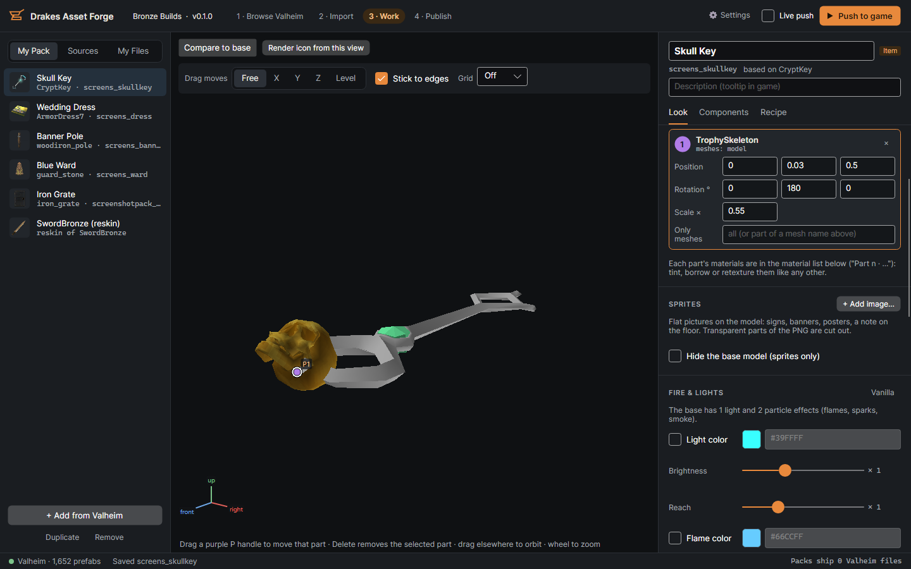
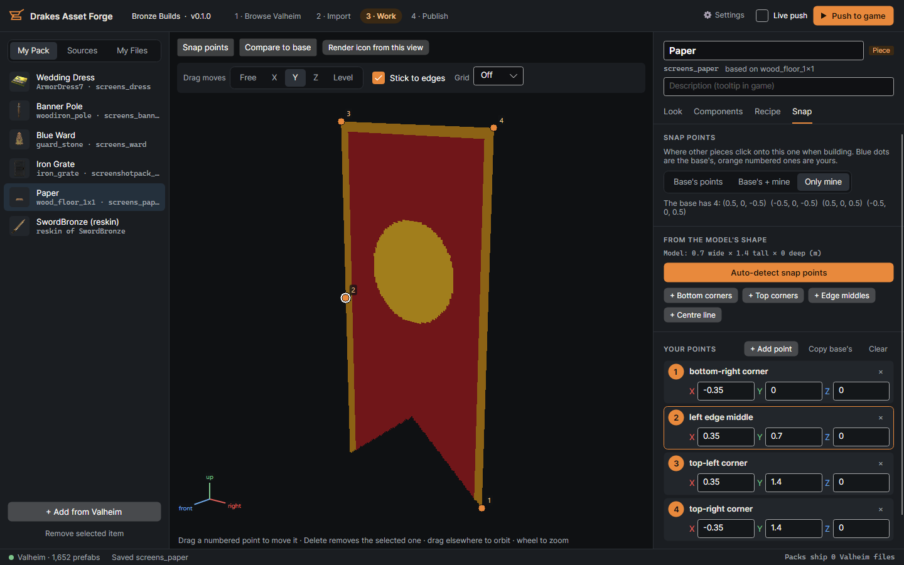
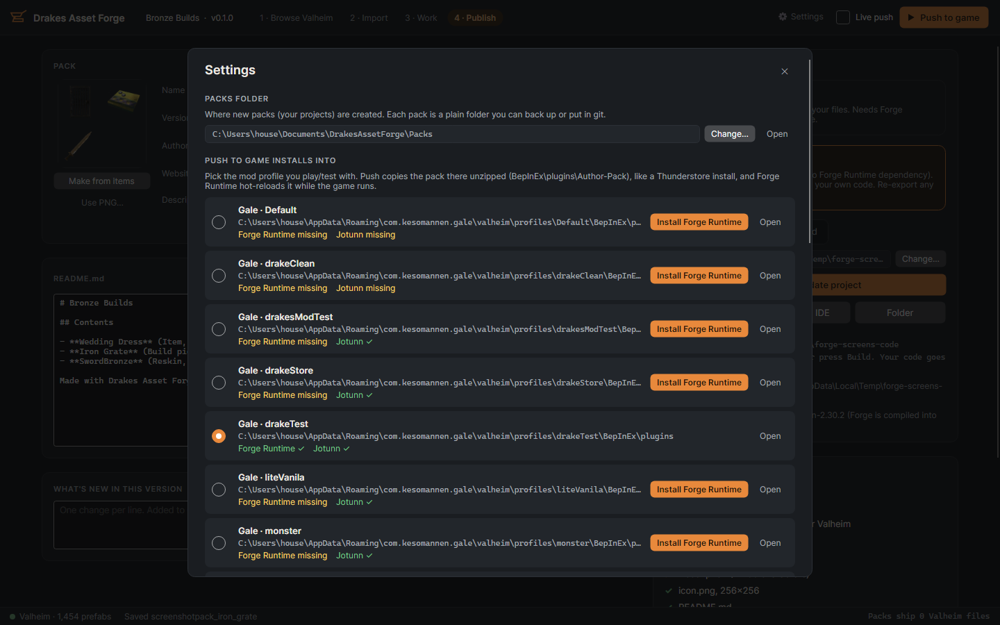

# Drakes Asset Forge

Make Valheim items, build pieces and reskins **without Unity**: browse the game, pick a starting point, restyle it,
change its stats, and push it straight into your game while it's running.

Packs never contain Valheim's models or textures. Meshes and materials are borrowed **by name** from the player's own
install when the game loads, so a pack is a few small text files plus whatever PNGs you made.


## New in 0.3

- **Kitbashing**: put other Valheim prefabs' meshes on your item or piece (a skull on a key, a lantern on a pole), each
  with its own position, rotation, scale and materials; drag them in the viewport. **Model scale** resizes the whole model.
- **Duplicate, copy and paste** items in the pack list (also across packs, images included); Remove works again.
- **Command line**: `inspect`, `validate`, `render`, `new-pack`, `export-code`, so packs can be made and checked without the UI.
- **Plain C# export options**: images inside the DLL, DrakeModsLibs helpers, looks only.
- **Fix**: a build cost naming an item by display name or wrong case ("Piece of Paper", "wood") crashed removing the
  piece in game. Forge Runtime 0.3.0 resolves or leaves out such costs; the app warns and saves the right id.

Packs using these need **Forge Runtime 0.3.0**. Full list in [CHANGELOG.md](CHANGELOG.md).

## New in 0.2

- **Sprites**: flat pictures on any item or piece (banners, signs, posters, a note on the floor), or as its whole look.
- **Snap points, redone**: auto-detected from the model's shape; drag numbered points in the viewport with axis locks
  and edge/grid snapping; every point named by where it sits.
- **Fire, lights and glow**: recolour flames and lights, glowing materials with a strength above plain white.
- **Remove and add components**: a ward without warding, a piece with a Rigidbody, any Valheim script with its defaults.
- **Plain C# export**: your items as readable Jotunn code, no Forge needed.

Packs using these need Forge Runtime 0.2 or later.

## What you can do

- **Browse Valheim**: every item and build piece in your install with a real 3D preview, its materials and shaders,
  its icon, its components and its vanilla build cost. Add what you want to work from to a working list.
- **Import**: each one becomes a *new item* (its own ID, copies the vanilla cost), a *reskin* (changes the vanilla
  one everywhere), or a *source* to borrow meshes and materials from.
- **Restyle**: borrow any prefab's mesh or material from a visual picker, tint with a colour picker, gloss/metallic,
  replace or export any texture slot (normal maps too), render an icon from the viewport.
  Armour shows as worn, including the textures it paints onto the player's body.
- **Change anything**: every setting on the base's scripts (ItemDrop, Piece, WearNTear, Door, Container…) with its
  vanilla value, proper controls (dropdowns for enums, toggles, colours), search, and one-click reset. Costs, crafting
  station, hammer tab, and a glow light.
- **Snap points**: auto-detected from the model's shape, or drag numbered points in the viewport (lock to an axis or
  level, stick to edges or a grid), each named by where it sits ("bottom-left corner").
- **Kitbashing**: build new shapes from pieces of Valheim, no modelling. Scale a swamp key up, put a skull on it, give
  each part its own materials; drag parts in the viewport. Parts are borrowed by name, so packs stay tiny.
- **Sprites**: put flat pictures (PNG with transparency) on any item or piece: a banner on a pole, a sign, a poster,
  a note lying on the floor. Size, position, rotation, one or both sides; or hide the base model so the picture is
  the whole look. No 3D modelling needed.
- **Fire, light and glow colours**: recolour a brazier's flames and light, make a ward burn blue, and change
  what a material glows (emission colour plus strength, so runes can glow brighter than plain white).
- **Remove and add components**: a ward clone without warding (remove `PrivateArea`, after an "are you sure?"
  that says what it costs), or add a Rigidbody, a collider, a light, or any Valheim script (Container, Door, Vagon…)
  with the game's own default settings, all editable.
- **Push to game**: installs the pack into your Gale / r2modman / Thunderstore Mod Manager profile and hot-reloads it
  while Valheim runs.
- **Publish** as either:
  - a **data pack**: a Thunderstore-ready zip (README, CHANGELOG, icon made from your items) that needs
    [Forge Runtime](#forge-runtime), or
  - a **C# mod project**: Forge compiled into your own mod (no runtime dependency) with a `Customize\<Item>.cs` file
    per item for your own code. Re-export any time; your code is kept.
  - **plain C#**: each item as readable Jotunn code (typed settings, materials, fire colours) plus one small helper
    file. No Forge and no pack files; only Jotunn is needed. Take it from there by hand.

| | |
|---|---|
|  |  |
|  |  |
|  |  |
|  |  |
|  |  |
|  |  |
|  | |

## Where it's going

Asset Forge is becoming **the** way to make Valheim content without Unity: start from anything in the game, change
how it looks and how it works, try it live in a running game, and ship it as a tiny data pack or as your own C# mod.
No asset bundles, no mocked game scripts, and never a copy of Valheim's files in what you publish. And no lock-in:
every pack can be exported as code you own.

### Coming next

- **Model export**: any Valheim mesh with its textures as `.glb`, to open in Blender (for your own editing; Valheim's
  files can't be redistributed).
- **Model import**: your own static `.glb` meshes in packs, loaded by Forge Runtime. No Unity, no asset bundles.
  Rigged meshes (armour, capes) come after that.

### Later

- Item crafting costs read from vanilla (piece costs already are).
- Hot reload that also restores removed component settings.
- Publishing packs to Thunderstore from the app.

Ideas and requests: [issues](https://github.com/drakethos/DrakesAssetForge/issues).

## Get it

**Portable:** download **`DrakesAssetForge-<version>-win-x64.zip`** from
[Releases](https://github.com/drakethos/DrakesAssetForge/releases), unzip anywhere, run `DrakesAssetForge.exe`.
No .NET install needed.

**Hexium / Gale:** install the **`DrakeMods-DrakesAssetForge`** package (exe + icon + modpack-style
dependencies). Gale puts it under `BepInEx/plugins/DrakeMods-DrakesAssetForge/` — run `DrakesAssetForge.exe`
from there. The package pulls **Forge Runtime** and Jotunn. Same zip is attached to the GitHub Release as
`DrakeMods-DrakesAssetForge-<version>.zip` for "Import local mod".

You need Valheim installed (the app reads it; it never changes it) and a mod-manager profile with BepInEx and
Jotunn to test in. ⚙ Settings can install Forge Runtime into that profile for you.

## Forge Runtime

The small (≈80 KB) BepInEx mod that loads data packs. Players install it once, plus any packs.
Releases are attached to `runtime-v*` [releases](https://github.com/drakethos/DrakesAssetForge/releases);
details in [Forge/Runtime/thunderstore/README.md](Forge/Runtime/thunderstore/README.md).

## Build from source

```
dotnet run --project Forge/App            # the app
dotnet build Forge/Forge.slnx             # everything
dotnet test Forge/Format.Tests
```

Building `Forge/Runtime` needs game references: locally from `environment.props` (Valheim path + your mod profile;
see [Forge/README.md](Forge/README.md)), in CI from the Pfhoenix reference package + Jotunn (`-p:ForgeRefsDir=…`).

| Folder | |
|---|---|
| `Forge/App` | the desktop app (Avalonia) |
| `Forge/Valheim` | reads the player's install: catalog, meshes, materials, icons, component fields; software renderer |
| `Forge/Format` | pack/recipe format (no dependencies), shared by app and runtime |
| `Forge/Runtime` | Forge Runtime (BepInEx), also compiled into C# mod exports |
| `Forge/samples` | example pack |
| `legacy/` | the previous Catalog/Project/Export app, kept for reference (not built) |

Format, recipe keys and the C# export layout: [Forge/README.md](Forge/README.md).

## Releasing

One workflow, two release trains, picked by tag (version must match the project file):

| Tag | Builds | Publishes |
|---|---|---|
| `app-v0.3.0` | Portable win-x64 zip **and** Hexium/Gale package (`DrakesAssetForge.exe` + icon + manifest, Tools/Modpack) | GitHub Release (draft); Hexium when `PUBLISH_HEXIUM=true` |
| `runtime-v0.3.0` | `Forge/Runtime` Thunderstore package | GitHub Release (draft); Thunderstore and Hexium only when enabled |

GitHub releases are created as **drafts**: check the notes and files on the Releases page, then press *Publish release*.

Store uploads are off until you turn them on with repository variables `PUBLISH_THUNDERSTORE=true` /
`PUBLISH_HEXIUM=true` (secrets `THUNDERSTORE_TOKEN`, `HEXIUM_TOKEN`). App Hexium upload uses
`.github/scripts/publish-hexium.py` (same as LockSmith / RenameIt).

## License

MIT, see [LICENSE](LICENSE).
